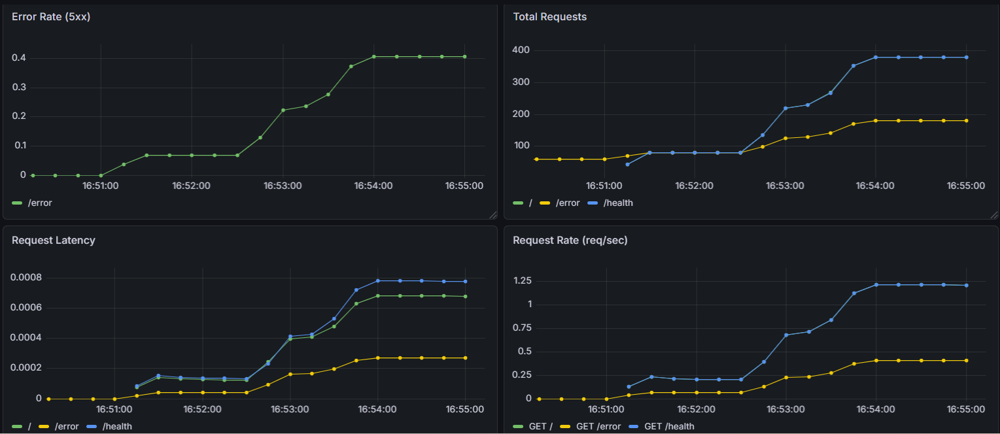

# 🚀 DevOps Monitoring Project

A complete monitoring stack using **FastAPI + Prometheus + Grafana + Docker**
Built to demonstrate real-world DevOps and observability skills.

---

## 📌 Overview

This project simulates a production-like service with full monitoring:

* FastAPI application exposing metrics
* Prometheus scraping metrics
* Grafana visualizing data
* Docker Compose orchestrating everything
* Pre-configured dashboards via provisioning

---

## 🛠 Tech Stack

* **Backend:** FastAPI (Python)
* **Monitoring:** Prometheus
* **Visualization:** Grafana
* **Containers:** Docker & Docker Compose
* **CI:** GitHub Actions

---

## ✨ Features

* REST API with multiple endpoints
* `/metrics` endpoint for Prometheus
* `/health` endpoint
* `/error` endpoint to simulate failures
* Request counting
* Latency tracking
* Error rate monitoring (5xx)
* Pre-built Grafana dashboard
* Fully dockerized setup

---

## 📊 Grafana Dashboard



---

## 📈 Metrics Included

* ✅ Total Requests
* ✅ Requests per Second
* ✅ Request Latency
* ✅ Error Rate (5xx)

---

## 📂 Project Structure

```
devops-monitoring-project/
├── app/
│   └── main.py
├── grafana/
│   ├── dashboards/
│   │   └── fastapi-dashboard.json
│   └── provisioning/
│       ├── dashboards/
│       │   └── dashboard.yml
│       └── datasources/
│           └── datasource.yml
├── prometheus/
│   └── prometheus.yml
├── docs/
│   └── dashboard.png
├── docker-compose.yml
├── Dockerfile
├── requirements.txt
└── README.md
```

---

## ▶️ Run the Project

```bash
git clone https://github.com/LiorYakoboich/devops-monitoring-project.git
cd devops-monitoring-project

docker compose up --build
```

---

## 🌐 Access Services

| Service    | URL                           |
| ---------- | ----------------------------- |
| App        | http://localhost:8000         |
| Metrics    | http://localhost:8000/metrics |
| Prometheus | http://localhost:9090         |
| Grafana    | http://localhost:3000         |

---

## 🔐 Grafana Login

```
username: admin
password: admin
```

---

## ⚡ Generate Traffic

```bash
for i in {1..100}; do
  curl -s http://localhost:8000/ > /dev/null
  curl -s http://localhost:8000/health > /dev/null
  if (( i % 3 == 0 )); then
    curl -s http://localhost:8000/error > /dev/null
  fi
  sleep 0.2
done
```

---

## 🧠 What This Project Shows

* Monitoring architecture
* Metrics collection
* Dashboard design
* Docker orchestration
* DevOps thinking

---

## 🔮 Future Improvements

* Alerts (Grafana / Prometheus)
* Kubernetes deployment
* Load testing
* Cloud deployment

---

## 👩‍💻 Author

Lior Yakobovich
